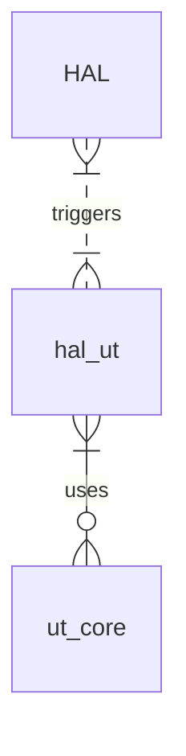

# Unit Testing - Hal Testing Suite

| Date   | Author       | Comment | Version |
|--------|--------------|---------|---------|
| 23/02/22 | G. Weatherup | Reviewed & Updated| 1.1.0|
| 30/09/22 | G. Weatherup | Initial release| 1.0.0|

## Scope

To develop a L1, L2 testing suite to support vendor deliverables. This combines API Documentation, Specifications and Tests, delivered without infrastructure and RDK framework requirements.

## HAL Scope

Each of the HALS will use the hal `UT-Core` framework, it will provide all the configuration required to support building and running a common testing environment.

Each HAL component definition, will have individual cadence, specific documentation, and tagged testing suites to support them. All code is shared in the `comcast-sky` git hub, currently for internal consumption.

- [HAL Test Framework URL - Comcast-Sky GitHub](https://github.com/orgs/comcast-sky/repositories?q=rdk%2Fcomponents%2Fhal%2F&type=all&language=&sort=name)

The naming convention chosen will allow for future convergence of the RDK-B/RDK-V/RDK-X stack into a single component based definition.

Naming convention as follows:-

```bash
- rdk-components-hal-<componentName>
- rdk-components-haltest-<componentName>
```

## Build Environment Requirements

In order to build the tests files, there is a requirement to supply the toolchain, either as a vendor independent toolchain, an SDK, or an RDK toolchain.

The `ut` for a given module is triggered from scripts / makefiles which clone the `ut-core` framework, and then build the tests defined.

This allows the `ut-core` framework to be upgraded over time, and have independence of the `ut` unit being tested.

Script templates are provided to show examples files that will be required of reach layer, starting from the hal.

Testing relationship is as follows:-



```bash
├── template
│   ├── api_definition_template -> example trigger files for the top level `API` directories
│   └── ut_template -> example component specific files for the ut directories
```

### SDK Toolchain

Am example toolchain is provided for RDK-B, and this is located in github at the below address.

### Core UT Framework

Unit testing core subsystem is available from the following location

[https://github.com/comcast-sky/rdk-components-ut-core]

Cloning the core ut-code is available from here:

```bash
git clone git@github.com:comcast-sky/rdk-components-ut-core.git
```

It is recommended that you read the documentation :-

- [https://github.com/comcast-sky/rdk-components-ut-core/blob/master/README.md]
- [https://github.com/comcast-sky/rdk-components-ut-core/blob/master/docs/pages/halUnitTesting_requirements.md]

```bash
.
├── docs
│   └── pages
│       └── images
├── framework
│   └── cunit
│       ├── arm-rdk-linux-gnueabi -> Arm prebuild version of cunit.so
│       └── i686-pc-linux-gnu -> -> Linux prebuild version of cunit.so
│   └── xxx -> Other framework as required
├── include -> ut-core header files
├── src     -> ut-core source files
├── template
│   ├── hal_template -> example files for the top level hal directories
│   └── ut_template -> example files for the ut directories
└── tools
├── libs -> (Vendor .so)
├── Makefile

```

In order to build the `vendor`, or the `developer` will need to provide any of the following requirements.

1) prebuilt libraries which as part of the SDK
2) prebuilt libraries to be linked against in the libs directory
3) link libs directory to built libraries being worked on in RDK Tree.

`libs`, can be either linked to a prebuilt generated by the vendor, or by the RDK build system.

e.g.

```build-skysr300/tmp/work/armv7at2-neon-rdkmllib32-linux-gnueabi/lib32-hal-wifi-sky/1.99+git999-r0/hal-wifi-sky-1.99+git999/.libs/```

`ln -s <source> <destination>` can be used to setup these directories

### Toolchain

Toolchain is provided by the vendor, or via an SDK build in the Yocto build system for the given platform.

Recommand to install the toolchain into `./tools/2.0` directory

A sample SDK installer script for RDK-B, using an ARM compiler is shared location [https://github.com/comcast-sky/rdk-component-yocto-rdk-sdk](https://github.com/comcast-sky/rdk-component-yocto-rdk-sdk)

#### How to use SDK Toolchain

```bash
cd ./tools
git clone git@github.com:comcast-sky/rdk-component-yocto-rdk-sdk.git
cd rdk-component-yocto-rdk-sdk
./rdk-glibc-x86_64-arm-toolchain-2.0.sh
```

This will install the toolchain, `sysroots` etc into `/opt/rdk/2.0` by default, but it's recommended that that you change this to `${PWD}../2.0` folder in your linux machine.

Example output

```bash
RDK (A Yocto Project based Distro) SDK installer version 2.0

============================================================
Enter target directory for SDK (default: /opt/rdk/2.0):
You are about to install the SDK to "/opt/rdk/2.0". Proceed \[Y/n\]? Y
`\[sudo\] password for xxxx:`
Extracting SDK..............................................................................done
Setting it up...done
SDK has been successfully set up and is ready to be used.
Each time you wish to use the SDK in a new shell session, you need to source the environment setup script e.g.

. /opt/rdk/2.0/environment-setup-cortexa9t2-vfp-rdk-linux-gnueabi
```

4.Once to use cross development toolchain in the current shell, you need to source the environment setup script.

```bash
chmod +x /opt/rdk/2.0/environment-setup-cortexa9t2-vfp-rdk-linux-gnueabi`
source /opt/rdk/2.0/environment-setup-cortexa9t2-vfp-rdk-linux-gnueabi
echo $CC
```

```bash
arm-rdk-linux-gnueabi-gcc -mthumb -mfpu=vfp -mcpu=cortex-a9 -mfloat-abi=soft -mabi=aapcs-linux -mno-thumb-interwork -ffixed-r8 -fomit-frame-pointer --sysroot=/opt/rdk/2.0/sysroots/cortexa9t2-vfp-rdk-linux-gnueabi
```

## Testing Environment

## Making the code

There are two targets for the platform

1. linux - (default) will build all the tests, the test_app, and the stubs
2. arm - TARGET=arm, will build all the tests, and the test_app for the target

```bash
make clean
```

is not required unless you swap between targets or wish to clean

### Build the `linux` environment

```bash
make
```

This will build the following directories `src/*.c`, in addition to core functions from `ut-core/src/*.c` and linking against libraries in `ut-core/framework`

`skeletons/src` - will be included in the linux build to enable stubs to compile against

### Build the target `arm` environment

The toolchain must be sourced as above, once sources though swapping between linux & arm is possible as required.

```bash
make TARGET=arm
```

TThis will build the following directories `src/*.c`, in addition to core functions from `ut-core/src/*.c` and linking against libraries in `ut-core/framework` and link against `libs/.so` or from `sysroot` path in the SDK.

The final output binary is build as `hal_test` and resides in the `bin` directory, the framework .so files will be copied to the same directory.

## Running on the target

Copy files from `bin/*` to the target.

Log into the target.

Assuming the files that are copied are in the `/home/root` directory, then the following export is required.

```bash
export LD_LIBRARY_PATH=/usr/lib:/lib:/home/root
```

or use the `run.sh`, which is in the same directory

Now the hal test can be executed, `-h` for help is supported.

```bash
./hal_test  -h
Help
-c - Console Mode (Default)
-a - Automated Mode
-b - Basic Mode
-f - <filename> - set the output filename for automated mode
-l - List all tests run to a file
-h - Help
```

### Modes of operation

1. Console Mode - will open the interactive console
2. Automated Mode - will output in xUnit form as a .xml file
3. Basic Mode - All tests will be ran and the output redirected to the shell

## Source Tree `UT` Unit Test Directory

The tests are defined into the following structure, as per the template from `template/ut_template/`
, which can be copied to the root directory if your specific `rdk-component-haltest-xxx` directory for a baseline.

 ```bash
├── bin
│   └── run.sh
├── build.sh
├── docs
│   ├── generate_docs.sh
│   └── pages
│       ├── L1_TestSpecification.md
│       ├── L2_TestSpecification.md
│       ├── L3_TestSpecification.md
│       └── README.md -> ../../README.md
├── Makefile
├── mocks
│   ├── include
│   └── src
├── README.md
├── skeletons
│   └── src
├── src
│   ├── main.c
│   ├── test_l1_test_example.c
│   └── test_l2_tests_example.c
└── tools
```

The main launch point test application, will configure the test system install the framework and register the tests.

```bash
├── src
│   ├── main.c
```

The main test app will register all the tests and kick off the framework.

```c
    UT_status_t status;
    status = UT_init( argc, argv );
    if ( status != UT_STATUS_OK )
    {
      /* UT Initialise failed */
      return -1;
    }

    register_hal_l1_tests();
    register_hal_l2_tests();

    UT_run_tests();
```

### Example of registering test functions with the framework is

```c
#include <string.h>
#include <stdlib.h>

#include <ut.h>

void test_l1_function1(void)
{
  UT_FAIL("Need to implement");
  /* Positive */
  /* Negative */
} 

void test_l1_function2(void)
{
  UT_FAIL("Need to implement");
  /* Positive */
  /* Negative */
} 

static UT_test_suite_t *pSuite = NULL;

/**
 * @brief Register the main tests for this module
 * 
 * @return int - 0 on success, otherwise failure
 */
int test_l1_register( void )
{
    /* add a suite to the registry */
    pSuite = UT_add_suite("[L1 test_Example]", NULL, NULL);
    if (NULL == pSuite) 
    {
        return -1;
    }

    UT_add_test( pSuite, "blah_level1_test_function", test_l1_function1);
    UT_add_test( pSuite, "blah_level1_test_function", test_l1_function2);

    return 0;
}
```

Each module has a optional `init` and `clean` function, which can be setup via UT_add_suite(), in the above example these are defaulted to `NULL`, since in this example case they are not used.

## Testing

The current file by file, and function by function, may not be the ideal way to support all L1 testing, since calling all functions without the init being called, is likely a requirement.

Other files maybe required, users should use their own description and best practices to perform and implement tests.


## Level 1 Testing - Functional Testing

The Level 1 testing suit will be classed as functional tests. The main goal of the tests are:

- Max / Min parameter testing should be performed for every function
- Passing invalid parameters (negative testing)
  - Passing invalid parameters, every function should fail as per the documentation
  - Every parameter should be tested for an invalid valid
- Passing Correct parameters (Positive testing)
  - Passing correct parameters
  - Checking from the box if possible is the actions have been performed correctly via other means, e.g. command line.

## Level 2 Testing - Module Testing

The purpose of the test level is to test the module functionality as much as possible from an operational point of view.

- independent test application that will run and build without the RDK on platform
- The application can be copied after building to a running box.
- Application will perform the startup requirements for the section of the HAL required to test, in order to perform Black Box Testing
- Features to be defined on whether it can be functionally tested or not.

## Autogen scripts

Please refer to [docs/pages/autogenTemplate.md](autogenTemplate.md)
