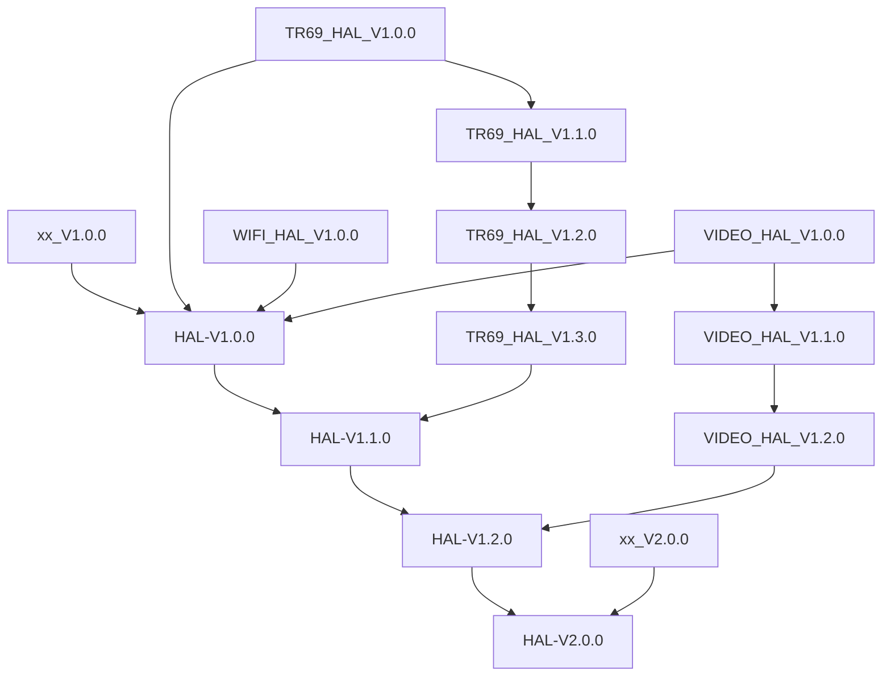

# HAL Unit Testing

| Date | Author | Comment | Version |
| --- | --- | --- | --- |
| 21/07/22 | G. Weatherup | First Release | 1.0.0 |

## Table of Contents

- [Overview](#overview)
- [Acronyms](#acronyms)
- [Definitions](#definitions)
- [References](#references)
- [Overview of Requirements and Process](#overview-of-requirements-and-process)
- [Requirements for the HAL Testing Suite](#requirements-for-the-hal-testing-suite)
- [Testing Requirements](#testing-requirements)
	- [Level 1 Testing - Functional Testing](#level-1-testing-functional-testing)
	- [Level 2 Testing - Module Testing](#level-2-testing-module-testing)
	- [Level 3 Testing - External testing](#level-3-testing-external-testing)
	- [Level 4 Testing - Full Stack testing](#level-4-testing-full-stack-testing)
- [Requirements for Documentation](#requirements-for-documentation)
- [Delivery Requirements](#delivery-requirements)
    - [Constraints](#constraints)
- [Feedback loop](#feedback-loop)
- [Deployment of the codebase](#deployment-of-the-codebase)
	- [HAL Directory structure](#hal-directory-structure)
- [Requirements for versioning](#requirements-for-versioning)
    - [Revision Control](#revision-control)
    - [Proposed Version Numbering scheme](#proposed-version-numbering-scheme)

## Overview

This document defines the unit testing requirements the principles defined here apply to all `HAL`s.

## Acronyms

- `HAL` \- Hardware Abstraction Layer, may include some common components
- `HAL.h` \- Abstracted defined API to control the hardware
- `HAL.c` \- Implementation wrapper layer created by the `OEM` or `SoC` Vendor.
- `RDK` \- Reference Design Kit for All Devices
- `RDK-B` \- Reference Design Kit for Broadband Devices
- `RDK-V` \- Reference Design Kit for Video Devices
- `HTS` \- HAL Testing Suit
- `OEM` \- Original Equipment Manufacture (Sky is also an OEM)
- `SoC` \- System on a Chip

## Definitions

- `Broadcom` \- `SoC` manufacturer https://www.broadcom.com/
- `Amlogic` \- `SoC` manufacturer https://en.wikipedia.org/wiki/Amlogic
- `Soc Vendor` \- Definition to encompass multiple vendors
- `Unit Tests` \- C Function tests that run on the target hardware
- `Common Testing Framework` \- Off the shelf 3rd Party Testing Framework, or framework that does not require infrastructure to control it. That's not to say it cannot be controlled via infrastructure if required. Examples of which are.
    - GTest - https://google.github.io/googletest \- Google Test Suit
    - CUnit - http://cunit.sourceforge.net/) \- C Testing Suit
    - Unity - http://www.throwtheswitch.org/unity -C Embedded Testing Suit

## References

- `Feedback Loops` \- https://www.softwaretestingnews.co.uk/4-methods-to-improve-your-feedback-loops-and-supercharge-your-testing-process/
- `Doxygen` \- SourceCode documentation tool - https://www.doxygen.nl/index.html
- `Black Box Testing` \- https://en.wikipedia.org/wiki/Black-box_testing

## Overview of Requirements and Process

The `HAL` is designed to abstract manufacturer hardware from the software interfaces to support `RDK` based applications and upper layers.

The `RDK` **Upper Layers** are required to be agnostic and not rely on specific knowledge of the platform. The `HAL.h` is defined by the architecture team to bridge and abstract the layers.

| Upper Layers | Function |
| --- | --- |
| `Applications` | RDK Applications |
| `RDK-B` / `RDK-V` | Middleware |
| `HAL.h` | Interface defined by architecture team (header files) |

On other hand the **Lower Layers** are platform specific, either built by the OEM / SOC vendor or supported and implemented by the internal teams. Fundamentally important here is that there's a yardstick to pass before delivery.

| Lower Layers | Function |
| --- | --- |
| `HAL.c` | `HAL` implementation via either oem or internal teams |
| `SoC Vendor` | Vendor delivery code |

**The requirement for the `HAL` test suite is to test only the `Lower Layers` in isolation. The testing suit with use a combination `HAL.h` definitions and module testing / performance requirements**

## Requirements for the HAL Testing Suite

The core requirements for `HTS` Testing suite is as follows.

| Requirement | Comment |
| --- | --- |
| NON RDK STACK | RDK Full Stack **must not** be required (albeit for the `HAL.h` definition, or some common RDK HAL components), `HAL` is split into Vendor_HAL & Common_HAL. |
| Singe Package | A single versioned package can be deployed to the `OEM` / `SoC Vendor` . Vendor implementation can link to this specific version of the `HAL` |
| `Common Framework` | A common framework will be used to control tests |
| Run on the target | Unit Tests will be created using the `Common Framework`, these will run on the target hardware |
| Tests will be broken down into Levels | 4 levels expected |
| Documentation | on `HTS` and `HAL` is either accessible from a single resource, ( website etc. ), or possible to build to be rebuilt, or can be deployed with the package. Documenting the tests will also be via doxygen |
| Re-usable | layered testing approach, both for delivery and usability |
| Platform independent | Tests will be platform independent, and use the `HAL` definitions / documentation to implement. No test shall have platform specific features, but features may or may not be enabled per platform. |
| Convergence | over time has to be considered between `RDK-B` & `RDK-V` |
| Source Control | Each testing component will have a separate git repo - This aids migration in convergence, and specific area testing |
| Component Versions | Each testing component will be independently versioned. So that it's possible for any platform to move `HAL` Component version without moving `HAL` Version if required, depending on platform requirements. |
| HAL Version | Each `HAL` release will be globally versioned across all components of the `HAL` |

- Over time this should be controlled by configuration files, but build switch for the moment could suffice

## Testing Requirements

The following table shows the levels of testing required, each requires a separate controlled framework.

| Level | Testing Requirement |
| --- | --- |
| 1   | `HAL` \- Function testing (`Common Framework`) |
| 2   | `HAL` \- Module Testing (`Common Framework`) |
| 3   | External Stimulus is required to validate and control device .e.g. (power switches, raspberry pi's etc.) `Common Framework` |
| 4   | `Upper Layer` \- RDK Stack Testing ( outside of the scope of HAL Testing , it is a requirement but needs to be tackled separately ) |

### Level 1 Testing - Functional Testing

The Level 1 testing suit will be classed as functional tests. The main goal of the tests are:

- Max / Min param testing should be performed for every function
- Passing invalid params ( negative testing )
    - Passing invalid params, every function should fail as per the documentation
    - Every param should be tested for an invalid valid
- Passing Correct params ( Positive testing )
    - Passing correct parameters
    - Checking from the box if possible if the actions have been performed correctly via other means, e.g. command line.

### Level 2 Testing - Module Testing

The purpose of the test level is to test the module functionality as much as possible from an operational point of view.

- independent test application that will run and build without the `RDK` on platform
- Application can be copied after building to either a running box, or a
- Application will perform the startup requirements for the section of the `HAL` required to test, in order to perform `Black Box Testing`
- Features to be defined on whether it can be functionally tested or not.

### Level 3 Testing - External testing

External device functionality testing, in the case where the device has to perform correctly via external stimulus.

- Independent testing using a 3rd Party device maybe required
- Testing framework should be able to control the device, and triggered the test as a black box, gathering pass / fail criteria
- Performance testing of the module is maybe required.

### Level 4 Testing - Full Stack testing

`RDK` Stack testing is outside of the scope of this document, it is a requirement to be completed but requires a full RDK integration, either via `TDK` or a-other RDK Stack testing.

`RDK` middleware and application is a complexity in it's own right

## Requirements for Documentation

Universal standard for documentation is doxygen, examples of which can be found below, it is a requirement for the unit tests to comply with the doxygen standards for code commenting. All tests need to be commented, and the tests should be

- [Eigen Doxygen Example](http://eigen.tuxfamily.org/dox/index.html)
- [CGal Org Doxygen](https://doc.cgal.org/latest/Manual/index.html)

## Delivery Requirements

The HAL Testing Suit (`HTS`), needs to contain the following components

| Module | Requirement |
| --- | --- |
| Framework | C-Unit / Unity framework |
| C Tests | C Tests build on the framework |
| C Code from vendor | Makefile system with C code from the vendor |
| C Common RDK Code | RDK HAL Common modules if required |
| Build system | Makefile subsystem to build the C Tests / Framework and link with the vendor code |

### Constraints

- HAL Testing framework must be independent of RDK upper layers and operate without any dependency.
- It is expected that the `HTS`, will build with minium effort using the compiler for the platform.

## Feedback loop

It is of virtual importance that a feedback loop occurs, simply put, it is the process of giving and receiving feedback from within the team.

Feedback loops could be automatic triggers when the code is committed, or when the code is submitted for review.

There must be a continual improvement into the testing infrastructure, a constant feed of data to improve, and all levels of that a feedback loop occurs.

We only learn and can improve when we embrace the fact that an error / mistake or omission, is something to feedback into the system.

Improvements in the quality of the documentation, the layered tests, both in lower and upper will take time.

A feedback loop for bugs feeding back into the testing is required in order to improve the testing.

It is expected therefore that the `oem` will automatically test all releases, and submit testing reports for every release..

Once committed to the final infrastructure it's optional but likely recommended for another test to be ran.

## Deployment of the codebase

- Hosted on git servers, the `HAL` layer header files will be available to clone as required. They will be platform independent and self contained, no upper references or external references (albeit for standard libraries), should be required to build the system.

### HAL Directory structure

- Example layers of the HAL / Testing infrastructure, in order to support component `HAL` this is the new requirement for organisation of the `HAL` going forward.

```
.
├── xxx_hal		-> git repo
│   ├── xxx_hal.h
│   ├── configure.ac
│   ├── CONTRIBUTING.md
│   ├── doc
│   ├── LICENSE
│   └── Makefile.am
...
└── yyy_hal		-> git repo
    ├── configure.ac
    ├── CONTRIBUTING.md
    ├── COPYING
    ├── doc
    ├── LICENSE
    ├── Makefile.am
    ├── NOTICE
    └── yyy_hal.h
```

## Requirements for Versioning

An important aspect of delivery is that both the `HAL` and the `HTS` are fundamentally linked together. To support this, we also require a code tagging and delivery model, that is scalable.

e.g. a change to the `HAL` requires a change to the `HTS`, although vice versa is not true. The `HTS` should improve on a regular basis based on feedback.

The testing suite will `git tag` actual versions together in the source code repository.

This is standard practice for using git with tags, and repo, in comcast terminology this is called the `federated` model.

### Revision Control

- Major `HAL` baseline releases will take place, with available component versions at time of creation.
- Individual components will have their own version, and life cycle
- New versions of specific component hals will be rolled into later `HAL` revisions
- No platform will be affected by the changes or upgrades to the `HAL`, until they decide if they wish to be affected.
- Only platforms that take the `federated` `HAL` will choose which version they are looking at.
- No Cherry Picking or merges to any branches is required, each platform decides what version of the `HAL` it wants to use, and can freeze on that version as required.
- Each component will have a vertical lifecycle, that can improve and change through time without affecting any other platform or device.

The following diagram shows an example of `HAL` versioning.



### Proposed Version Numbering scheme

`<prefix>-<major>.<minor>.<bugfix / patch / doc>`

Major - Non backward compatible change
Minor - Backward compatible change
Bugfix/Patch/Doc - Minor changes or bugfixes or document changes
