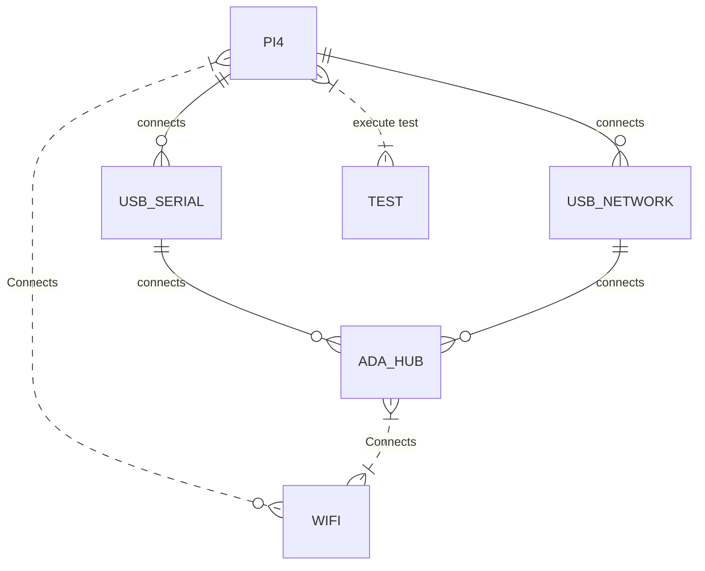

# Setup L3 Testing environment

| Date | Author | Comment | Version |
| --- | --- | --- | --- |
| 20/6/22 | G. Weatherup | Draft Revision | 1.0 |

# Scope

This document describes the option for Level 3 testing, ( out of the box ), which is deliverable to the vendor as a set of python scripts, that support simple configuration triggered from the command line.

# Testing Support Package

The support package contains the following hardware items.

| Package | Comment |
| --- | --- |
| Ada-Hub | Ada-HUB Device will cables/connectors |
| USB Serial Cable | USB Serial Device to connect to the ADA |
| USB Network Adaptor | USB Network Adaptor |
| Power Supply | Generic Ada Power Supply |
| Raspberry Pi4 | Generic off-the-shelf pi4, with ubuntu 21.04 installed, and either set up or self setup |



# Raspberry PI4 setup / configuration

If you wish to run the testing system, on other devices that have

| Requirement | Command |
| --- | --- |
| USB Serial | VCP USB Serial Driver |
| GCC / Make | Build Essential |
| Minicom | Serial Communication Program |
| Python VENV | Python Virtual Environment |
| USB Ethernet | Connection from Ethernet to Hub |

## Installing Build Essential

Build essential is required to support

```
sudo apt update
sudo apt install build-essential
```

## VCP USB Serial Serial Driver

If not already installed on your target device you will need to install the SI Labs serial

[https://www.silabs.com/documents/login/software/Linux\_3.x.x\_4.x.x\_VCP\_Driver_Source.zip](https://www.silabs.com/documents/login/software/Linux_3.x.x_4.x.x_VCP_Driver_Source.zip)

## USB Ethernet Adaptor

An external ethernet adaptor is required to support the platform.

In our example case, an anker USB adaptor

https://d2211byn0pk9fi.cloudfront.net/eu/accessories/attachments/3725/D9E0693FA9E8164_linux0003-r8152.53-2.05.0.tar.bz2?1579234543

But this was non-function, so the latest driver from Realtek provides a solution

`https://github.com/wget/realtek-r8152-linux`

Follow the instructions in the zip file to support building on the required platform.

Required package for ubuntu not installed on pi.

```
sudo apt-get install flex
sudo apt-get install bison
```

# Install Minicom

ADA-HUB Serial port configuration

| Config | Setting |
| --- | --- |
| Device | dev/ttyUSB0 |
| Setting | Bps/Par/Bits : 115200 8N1 |
| Hardware Flow Control | Off |

## Installing Python Requirements

Python `VENV` is setup via the following command

`./framework/core/installation/install_requirements.sh`

To run the testing system through the `VENV` run the tests with.

Activate the virtual environment

`. ./framework/core/installation/VENV/bin/activate`

# Hal Tests Current Status

# L1 - Test Name

1.  test\_generic\_wifi_init
2.  test\_generic\_wifi_reset
3.  test\_generic\_wifi_setLED
4.  test\_generic\_wifi_down
5.  test\_generic\_wifi_factoryReset
6.  test\_generic\_wifi_createInitialCo
7.  test\_generic\_wifi_createHostApdCo
8.  test\_generic\_wifi_startHostApd
9.  test\_generic\_wifi_stopHostApd

- **Total API's 9 / 183 (Min required tests)**

# L2 Tests

1.  L2\_set\_Valid\_SSID\_2GHz (test@1234
2.  L2\_set\_InValidIndex\_SSID\_2GHz
3.  L2\_set\_NULL\_SSID\_2GHz
4.  L2\_set\_Valid\_SSID\_5GHz
5.  L2\_set\_InValidIndex\_SSID\_5GHz
6.  L2\_set\_NULL\_SSID\_5GHz
7.  L2\_set\_Valid\_SSID\_6GHz
8.  L2\_set\_InValidIndex\_SSID\_6GHz
9.  L2\_set\_NULL\_SSID\_6GHz
10. L2\_set\_ap\_Disable\_2GHz
11. L2\_set\_ap\_Disable\_5GHz
12. L2\_set\_ap\_Disable\_6GHz
13. L2\_set\_ap\_Enable\_2GHz
14. L2\_set\_ap\_Enable\_5GHz
15. L2\_set\_ap\_Enable\_6GHz
16. L2\_set\_ap\_InValidIndex\_Disable
17. L2\_set\_ap\_InValidIndex\_Enable
18. L2\_valid\_channel\_push\_2GHz
19. L2\_Invalid\_channel\_push\_2GHz
20. L2\_Invalid\_Index\_channel\_push_2GH
21. L2\_valid\_channel\_push\_5GHz
22. L2\_Invalid\_channel\_push\_5GHz
23. L2\_Invalid\_Index\_channel\_push_5GH
24. L2\_valid\_channel\_push\_6GHz
25. L2\_Invalid\_channel\_push\_6GHz
26. L2\_Invalid\_Index\_channel\_push_6GH
27. L2\_set\_Valid\_bandwidth\_2GHz_40MHz
28. L2\_set\_Valid\_bandwidth\_2GHz_20MHz
29. L2\_set\_InValid\_bandwidth\_2GHz
30. L2\_set\_InValidIndex\_bandwidth\_2GH
31. L2\_set\_Valid\_bandwidth\_5GHz_20MHz
32. L2\_set\_Valid\_bandwidth\_5GHz_40MHz
33. L2\_set\_Valid\_bandwidth\_5GHz_80MHz
34. L2\_set\_Valid\_bandwidth\_5GHz_160MH
35. L2\_set\_Valid\_bandwidth\_5GHz\_80\_80
36. L2\_set\_InValid\_bandwidth\_5GHz
37. L2\_set\_InValidIndex\_bandwidth\_5GH
38. L2\_set\_Valid\_bandwidth\_6GHz_20MHz
39. L2\_set\_Valid\_bandwidth\_6GHz_20MHz
40. L2\_set\_Valid\_bandwidth\_6GHz_160MH
41. L2\_set\_Valid\_bandwidth\_6GHz_80MHz
42. L2\_set\_Valid\_bandwidth\_6GHz\_80\_80
43. L2\_set\_InValid\_bandwidth\_6GHz
44. L2\_set\_InValidIndex\_bandwidth\_6GH

- **Total Tests 44 / xx (Min required tests), TBC from documentation, and test requirements**

# L3 - Hal Test - 3rd Party Device Testing

Using the L2 Tests or dedicated L3 tests, the testing suite can trigger Tests / Balances outside of the box.

Basic setup is nearly there, fleshing out the below tests will cause the

- **Total 20 / xx (Min required tests), TBC from documentation, and test requirements**

**1\. SetSSID to know SSID
-\> Check via RaspPi that the SSID is correct**
2\. AP Disable / Enable
-\> Check via RaspPI iw commands that SSID is gone
3\. Change Freq, AP Enable, Bandwidth, Auth Method
-\> Check via RaspPi iw commands that this is correct.
-\> Break into a few extra tests here.
4\. AP Enable
-\> Check via PI
5\. Bandwidth
-\> Check via PI
6\. Auth Method
-\> Check via PI
7\. Reset SSID back to correct Value
-\> Check via RaspPi SSID is ok.

# Examples of future tests

8.  Throughput Test
    -\> ??? iPerf?
    
9.  System loaded throughput test
    -\> Load the CPU heavily.
    -\> Repeat the Throughput Test
    
    # Current Team
    

Framework L1 / L2 / L3 infrastructure setup - Gerald
L2 Tests - Palaksha Gowda

# Ada DUT

```
[a]. serialwm1: [00000000]
[b]. serialver: [00000000]
[c]. description: [ADA]
[d]. manufacturer: [SKY]
[e]. manufactureroui: [a0bdcd]
[f]. productclass: [ADA Router]
[g]. basemac: [a0bdcdff9be0]
[h]. wifimac: [a0bdcdff9be0]
[i]. btmac: [a0bdcdff9be0]
[j]. zigbeemac: [0000000000000000]
[k]. gpondslmac: [000000000000]
[l]. adsluser: [a0bdcdff9be0@skydsl]
[m]. adslpass: [dbqa57q8]
[n]. factoryssid: [SKYMC4YF]
[o]. factorypublickey: [Reserved]
[p]. wifipswd: [1J5nkBLQPSqG]
[q]. wpspin: [09141063]
[r]. modelnumber: [SR300]
[s]. hardwareid: [Reserved]
[t]. hardwareversion: [001]
[u]. serialnumber: [F60021BD000060]
[v]. skyserialnumber: [Reserved]
[w]. pmi: [SR300]
```