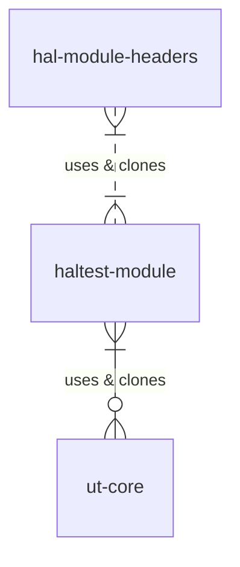

# Template Configuration

|Date|Author|Comment|
|------|----|--|
|G.Weatherup|0.1.0|Draft Revisions|

## Overview

This document is to describe the template framework that can be used to populate a sample test framework for the module you wish to operate on.

## References

| Reference | Description |
| --- | --- |
| [Comcast-Sky](https://github.com/comcast-sky) | Comcast Sky Git Hub Enterprise |
| [CMOCK](https://github.com/ThrowTheSwitch/CMock) | Auto generation tool for interface mocks|

## Acronyms

| Acronym | Meaning |
| --- | --- |
| `ut` | Unit test is a software development process in which the smallest testable parts of an application, called units, are individually and independently scrutinized for proper operation.|
| `ut-core` | Unit Test Core Common Framework  |
| `CMOCK` | C Language Mock, objects allow you to mimic the behavior of classes and interfaces, letting the code in the test interact with them as if they were real. This isolates the code you're testing, ensuring that it works on its own and that no other code will make the tests fail. |
| `component` | A software component is a unit of composition with contractually specified interfaces and explicit context dependencies only. A software component can be deployed independently and is subject to composition by third parties. |

## Framework overview

Repositories required

|Link|Description|
|----|-----------|
|[https://github.com/comcast-sky/rdk-components-ut-core]| Unit testing Code |
|[https://github.com/comcast-sky/rdk-components-haltest-wifi-rdkb.git]|Example HAL Test suite using `ut-core`|

The basic `UT` Unit Test framework, has a `ut-core`.

### Git/code repo relationships



## Expectations for Unit Tests

The same consistent layout is expected for all the `HAL` interfaces, this is the directory layout with the relevant .git repositories.

The following layout is defined from the TOP Level HAL Interface, 

```bash
rdk-components-hal-xxx.git
├── docs            (-> Documentation for the HAL interface)
├── include         (-> hal-xxx header files)
└── ut              (-> [rdk-components-haltest-xxx.git] `component` specific unit test )
    ├── docs        (-> `component` testing documentation )
    ├── mocks       (-> `component` mock HAL interface , generated using 'CMOCKS')
    ├── skeletons   (-> `component` interface skeleton files, used to build `linux` )
    ├── src         (-> `component` src for testing for this )
    └── ut-core     (-> [rdk-components-ut-core.git], core common framework )
```

## Template files are available for use

`build_ut.sh` - from the ut-core/template copied to the root directory of the `HAL` Headers directory, this will triggered the clone of the unit testing framework from github.
`build.sh` - this will be used for the HAL specific unit framework to build, and also clone the core `ut-core` git repository.

Every unit test for the HAL should have the same requirements :-

- ut/mocks - So the upper layers can mock the interface, autogenerated from 'CMOCK'
- ut/skeletons/src


### Generation of `CMOCKS` for the interfaces

<style>
red {
    color: red;
    text-shadow: 0 1px 1px rgba(0, 0, 0, 0.2);
}
orange {
    color: orange;
    text-shadow: 0 1px 1px rgba(0, 0, 0, 0.2);
}
green {
    color: green;
    text-shadow: 0 1px 1px rgba(0, 0, 0, 0.2);
}
blue {
    color: blue;
    text-shadow: 0 1px 1px rgba(0, 0, 0, 0.2);
}
redButton {
    color: white;
    border-radius: 4px;
    text-shadow: 0 1px 1px rgba(0, 0, 0, 0.2);
    background: rgb(202, 60, 60); 
}
blueButton {
    color: white;
    border-radius: 4px;
    text-shadow: 0 1px 1px rgba(0, 0, 0, 0.2);
    background: rgb(50,100, 255); 
}
orangeButton {
    color: white;
    border-radius: 4px;
    text-shadow: 0 1px 1px rgba(0, 0, 0, 0.2);
    background: rgb(223, 117, 20); 
}
greenButton {
    color: white;
    border-radius: 4px;
    text-shadow: 0 1px 1px rgba(0, 0, 0, 0.2);
    background: rgb(28, 184, 65); 
}
</style>