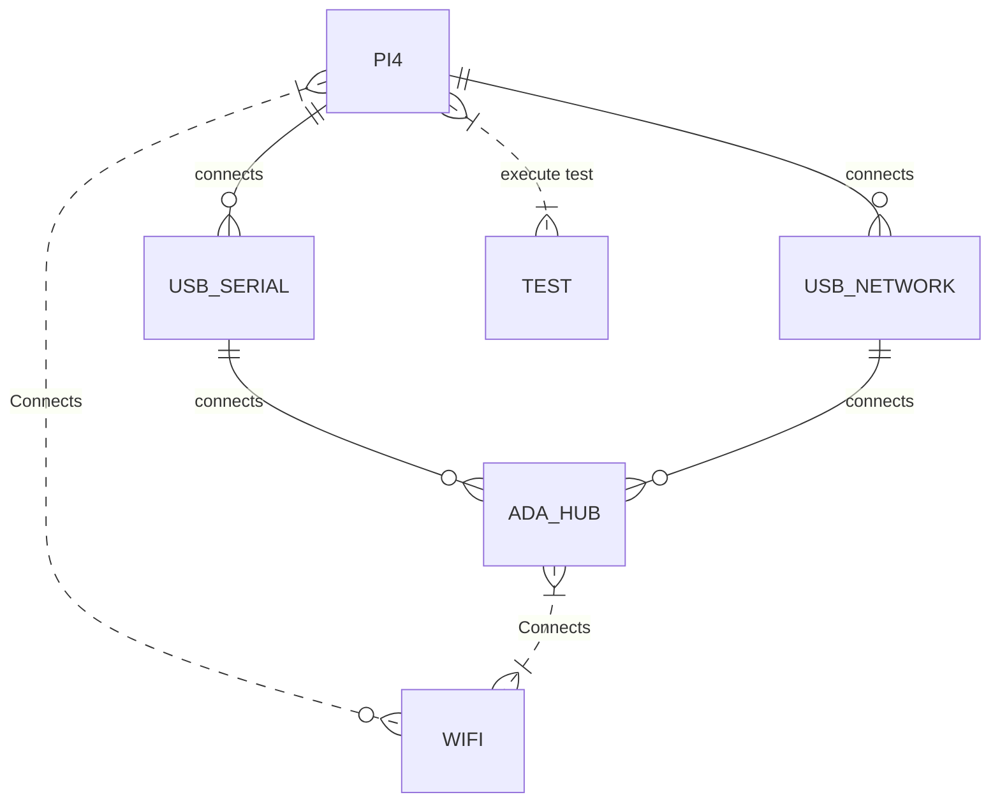

# Level 3 HAL Testing Specification (Draft)

## History

|Version|Date (YY-MM-DD)|Author|
|-------|-----|-----|
|1.0.0| 22/07/21 |Joe Bloggs|

## TODO: THIS DOCUMENT IS DRAFT AND NOT YET COMPLETE

## Document Scope

This document describes the option for Level 3 testing, ( out of the box ), which is deliverable to the vendor as a set of python scripts, that support simple configuration triggered from the command line.

## Table of Contents

- [Overview](#overview)
- [Acronyms](#acronyms)
- [Definitions](#definitions)
- [References](#references)
- [Testing Support Package](#testing-support-package)

## Acronyms

- `HAL` \- Hardware Abstraction Layer, may include some common components
- `HAL.h` \- Abstracted defined API to control the hardware
- `HAL.c` \- Implementation wrapper layer created by the `OEM` or `SoC` Vendor.
- `RDK` \- Reference Design Kit for All Devices
- `RDK-B` \- Reference Design Kit for Broadband Devices
- `RDK-V` \- Reference Design Kit for Video Devices
- `UT` \- Unit Test(s)
- `OEM` \- Original Equipment Manufacture (Sky is also an OEM)
- `SoC` \- System on a Chip

## Definitions

- `Broadcom` \- `SoC` manufacturer [https://www.broadcom.com/]
- `Amlogic` \- `SoC` manufacturer [https://en.wikipedia.org/wiki/Amlogic]
- `Soc Vendor` \- Definition to encompass multiple vendors
- `Unit Tests` \- C Function tests that run on the target hardware
- `Common Testing Framework` \- Off the shelf 3rd Party Testing Framework, or framework that does not require infrastructure to control it. That's not to say it cannot be controlled via infrastructure if required. Examples of which are.
  - GTest - [https://google.github.io/googletest] \- Google Test Suit
  - CUnit - [http://cunit.sourceforge.net/] \- C Testing Suit
  - Unity - [http://www.throwtheswitch.org/unity] -C Embedded Testing Suit
- `ut-core` - Common Testing Framework [https://github.com/comcast-sky/rdk-components-ut-core]

## References

- `Feedback Loops` \- [https://www.softwaretestingnews.co.uk/4-methods-to-improve-your-feedback-loops-and-supercharge-your-testing-process/]
- `Doxygen` \- SourceCode documentation tool - [https://www.doxygen.nl/index.html]
- `Black Box Testing` \- [https://en.wikipedia.org/wiki/Black-box_testing]

## Testing Support Package

The support package contains the following hardware items.

| Package | Comment |
| --- | --- |
| Ada-Hub | Ada-HUB Device will cables/connectors |
| USB Serial Cable | USB Serial Device to connect to the ADA |
| USB Network Adaptor | USB Network Adaptor |
| Power Supply | Generic Ada Power Supply |
| Raspberry Pi4 | Generic off-the-shelf pi4, with ubuntu 21.04 installed, and either set up or self setup |



## Raspberry PI4 setup / configuration

If you wish to run the testing system, on other devices that have

| Requirement | Command |
| --- | --- |
| USB Serial | VCP USB Serial Driver |
| GCC / Make | Build Essential |
| Minicom | Serial Communication Program |
| Python VENV | Python Virtual Environment |
| USB Ethernet | Connection from Ethernet to Hub |

### Installing Build Essential

Build essential is required to support

```
sudo apt update
sudo apt install build-essential
```

### VCP USB Serial Serial Driver

If not already installed on your target device you will need to install the SI Labs serial

[https://www.silabs.com/documents/login/software/Linux\_3.x.x\_4.x.x\_VCP\_Driver_Source.zip](https://www.silabs.com/documents/login/software/Linux_3.x.x_4.x.x_VCP_Driver_Source.zip)

### USB Ethernet Adaptor

An external ethernet adaptor is required to support the platform.

In our example case, an anker USB adaptor

https://d2211byn0pk9fi.cloudfront.net/eu/accessories/attachments/3725/D9E0693FA9E8164_linux0003-r8152.53-2.05.0.tar.bz2?1579234543

But this was non-function, so the latest driver from Realtek provides a solution

`https://github.com/wget/realtek-r8152-linux`

Follow the instructions in the zip file to support building on the required platform.

Required package for ubuntu not installed on pi.

```
sudo apt-get install flex
sudo apt-get install bison
```

### Install Minicom

ADA-HUB Serial port configuration

| Config | Setting |
| --- | --- |
| Device | dev/ttyUSB0 |
| Setting | Bps/Par/Bits : 115200 8N1 |
| Hardware Flow Control | Off |

### Installing Python Requirements

Python `VENV` is setup via the following command

`./framework/core/installation/install_requirements.sh`

To run the testing system through the `VENV` run the tests with.

Activate the virtual environment

`. ./framework/core/installation/VENV/bin/activate`

